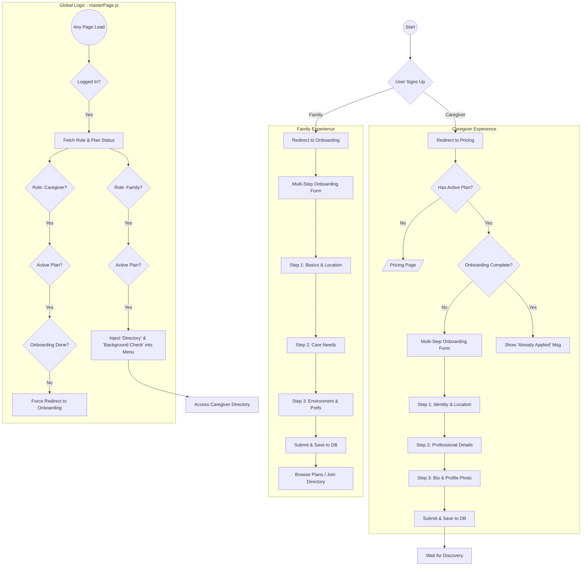

# Sitting With Pride - Documentation

## 🌟 Project Overview
Sitting With Pride is a specialized premium platform designed to connect families with qualified caregivers. The application features a robust onboarding experience, subscription-gated access, and a geographical-based directory system, all built on the Wix/Velo platform.

---

## 🚀 Full System Flow Chart

---

## 🛠️ Technology Stack
- **Platform**: Wix
- **Frontend/Backend**: Velo (JavaScript)
- **Database**: Wix Data Collections (`UserProfiles`, etc.)
- **Location Services**: Google Maps / ZIP Geo-lookup (via `location.web.js`)
- **Payment Processing**: Wix Pricing Plans
- **Logging**: Custom cloud logger (`logger.web.js`)

---

## 🧑‍💻 Core Components

### 1. Onboarding System
- **Universal Navigation**: State-based navigation with a centralized `navigate()` logic.
- **Validation**: Strict client-side validation for every step (ZIP regex, word counts, etc.).
- **Geo-integration**: Automatic latitude/longitude retrieval based on ZIP code for proximity searching.

### 2. Access Control (The "Guard")
The `masterPage.js` handles security and UX:
- **Caregiver Gating**: Ensures paid caregivers cannot skip onboarding.
- **Family Premium Menu**: Dynamically updates the site menu to show the Directory and Background Check options only to subscribing families.

### 3. File Directory
| File | Description |
| :--- | :--- |
| `masterPage.js` | Global logic for redirects and menu injection. |
| `caregiverOnboarding.js` | UI logic for the 3-step caregiver form. |
| `familyOnboarding.js` | UI logic for the 3-step family form. |
| `onboarding.web.js` | Backend functions for data persistence and profile management. |
| `location.web.js` | Geo-services for ZIP code mapping. |
| `pricing.web.js` | Logic for plan verification. |

---

## 🛡️ Security & Performance
- **Server-Side Verification**: Role and plan checks are performed via backend web modules (`.web.js`) for security.
- **Fail-Safe Retries**: Profile fetching includes retry logic to handle potential race conditions during member creation.
- **Log Monitoring**: Integrated logging allows for real-time error tracking and warning flags for navigation issues.

---

## 📈 Future Enhancements
- [ ] Integration with background check API.
- [ ] Advanced filtering for the Caregiver Directory (distance, languages, rates).
- [ ] Direct messaging between families and caregivers.
